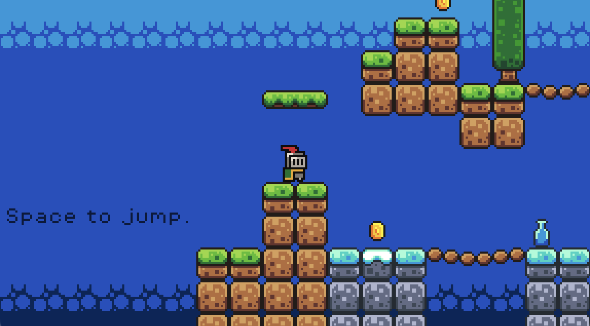

# My First Platformer

This is the first game I ever created, developed using the Godot engine. It is a simple yet fun platformer designed to showcase basic gameplay mechanics and keyboard controls.

## Controls
- Jump: W key or Spacebar  
- Move Left: A key or Left Arrow  
- Move Right: D key or Right Arrow  

The controls are designed to be intuitive and responsive, making it easy to navigate through the levels.

## About
This project marks my initial experience with game development using Godot. It helped me learn how to implement player movement, collision detection, and keyboard input handling. I plan to expand on this foundation with more features in the future.

## [License](LICENSE.md)
`Copyright (C) 2025 Rajveer Singh Saggu`
